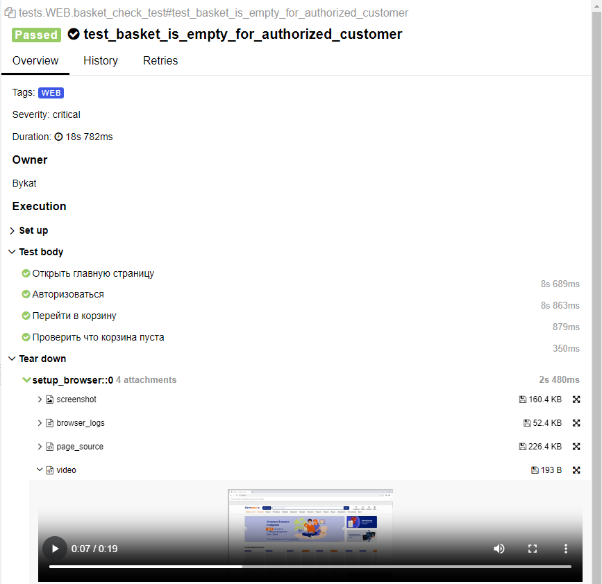

<h1> Проект по тестированию сервиса "Литрес"</h1>

> <a target="_blank" href="https://www.litres.ru">litres.ru</a>


<h3> Список Автоматиризованных проверок</h3>

#### UI-тесты
- [x] Авторизация с валидными данными 
- [x] Авторизация с невалидными данными (негативный кейс) 
- [x] Проверка состояния корзины по умолчанию для авторизованного пользователя
- [x] Проверка состояния корзины по умолчанию для неавторизованного пользователя
- [x] Проверка наличия баннера с промоакцией внутри корзины
- [x] Добавление продукта в корзину
- [x] Удаление продукта из корзины
- [x] Проверка поиска продукта по названию
- [x] Проверка поиска продукта по автору

#### API-тесты
- [x] Авторизация с валидными данными 
- [x] Авторизация с невалидными данными (негативный кейс) 
- [x] Добавление продукта в корзину
- [x] Проверка поиска продукта по названию
- [x] Проверка поиска несуществующего продукта (негативный кейс) 

----
### Особенности проекта

- Удаленный запуск через Jenkins
- Отчетность в Allure
- Сохранение артефактов (логов, скриншотов и видео)
- Интеграция с AllureTestOPS и Jira
- Оповещение в Telegram

### Стэк технологий
          

----
### Локальный запуск
Для локального запуска необходимо:

> 1. Клонировать репозиторий на свою локальную машину при помощи git clone

> 2. Создать и активировать виртуальное окружение:

  ```bash
  python -m venv .venv
  source .venv/bin/activate
  ```

> 3. Установить зависимости с помощью pip:

  ```bash
  pip install -r requirements.txt
  ```

> 4. Запустить тесты командой:

  ```bash
  pytest .
  ```

> 5. Получить allure отчёт:

```bash
allure serve allure-results
```

----
### Удаленный запуск автотестов выполняется через интерфейс сервиса Jenkins
> <a target="_blank" href="https://jenkins.autotests.cloud/job/vbukatov_diploma/">Jenkins</a>


Для запуска автотестов в Jenkins необходимо:

> 1. Открыть <a target="_blank" href="https://jenkins.autotests.cloud/job/vbukatov_diploma/">Страницу проекта</a>

> 2. Выбрать пункт `Build Now`

> 3. Результаты выполнения тестов сборки можно посмотреть в отчёте Allure

----
### Allure отчет

#### Обзор результатов


#### Список тест кейсов прогона


#### Отчет о выполнении UI-теста



#### Отчет о выполнении API-теста


----
### Allure TestOps 
#### (статистика выполнения тест-планов, отчёты и приложения к ним) 
> <a target="_blank" href="https://allure.autotests.cloud/project/4235/dashboards">AllureTestOps</a> (доступ по запросу у `admin@qa.guru`)

#### Тест-планы проекта


#### Общий список всех кейсов проекта


#### Отчёт о выполнении одного из автотестов


#### Тестовые артефакты (приложения)


#### Дашборд с общими результатами тестирования


#### История запуска тестовых сборок


----
### Интеграция с Jira
> <a target="_blank" href="https://jira.autotests.cloud/browse/HOMEWORK-1230">Jira</a>


----
### Оповещение о результатах тестового прогона в Telegram


----
### Видео с выполнением одного из UI-автотестов

